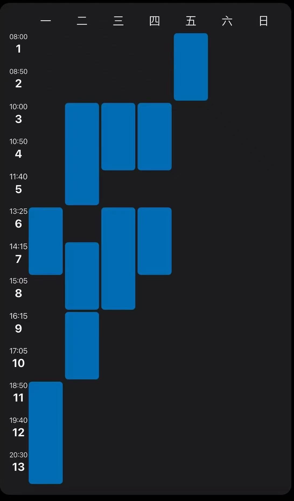

# 跨越“新手村”：从入门到找门 :door:

对接 SuDIS 实验室 推理加速 研究方向

---

## 一、 学习情况

---

## 一、学习情况

### 01. CS229 & Math for ML

**理论深度：从数学基础到优化本质**

- **学习内容**：
  - 二阶优化算法、Hessian 矩阵分析、概率生成模型采样理论。
- **掌握能力**：
  - **深度优化诊断**：能够从曲率视角理解优化瓶颈，而非盲目调参，具备解决模型收敛问题的数学直觉。
  - **采样算法建模**：深入理解分布对齐，为了解**自投机解码**中的接受概率函数打下概率论基础。

---

## 一、学习情况

### 02. CS336: Modern LLM from Scratch

**架构实操：Transformer 纵向拆解与重构**

- **学习内容**：
  - 了解 RoPE、RMSNorm、Multi-Head Attention 及训练流水线。
  - 显存层次结构（SRAM vs HBM）、Memory Wall 瓶颈分析、算子访存比。
- **掌握能力**：
  - **架构审计**：深度理解 Token 流转物理意义，能评估不同架构变体对显存压力的影响。
  - **瓶颈对抗**：深刻意识到 **Memory Wall** 是推理的第一阻碍，掌握通过视觉 KV Cache 压缩等手段绕过带宽限制的策略。

---
## 二、 课题组研究对齐

### ACL'24 自投机解码 (Self-Speculative Decoding) 的底层逻辑

* **范式重构**：利用计算的冗余性来弥补存储的局限性。
* **核心矛盾**：解决 LLM 推理中的 **Memory-bound**（访存受限）问题。
* **多模态机遇**：利用视觉与语言之间巨大的 **信息密度差**。

> **洞察点**：自投机不仅是加速手段，更是对大模型推理“预测-校验”并行机制的深度利用。

---

## 分析一：访存瓶颈的“降维打击” 
### 核心观点 用“廉价的计算”对冲“昂贵的访存”

* **痛点剖析**：大模型生成 Token 的速度受限于 **显存带宽** (HBM Bandwidth)，而非 GPU 的算力。每生成一个 Token 都要全量读取权重。
* **自投机本质**：在一次权重加载周期内，利用空闲算力预测后序多个 Token。
* **多模态启发**：
    * VLM 的视觉特征加载压力远超纯文本。
    * 通过“预测换带宽”的性价比在多模态场景下会被放大。

---

## 分析二：模型内生性的“架构红利”
### 核心观点 打破“大小模型”耦合，实现端侧闭环

* **技术演进**：传统投机解码需要训练/维护辅助模型 (Draft Model)，带来显存占用和 **分布偏移** (Distribution Shift)。
* **自投机本质**：利用 Transformer 层间冗余性，通过 Skip-layer 或 Early-exit 实现“模型内生性”。
* **多模态启发**：
    * **架构轻量化**：无需额外视觉处理器，直接复用 VLM 浅层视觉特征作为“草稿”。
    * **端侧友好**：为在手机/Jetson 等资源受限设备上运行 VLM 提供了可行路径。

---

## 分析三：视觉信息的“稀疏性契机”
### 核心观点 非均匀采样是多模态推理的“必杀技”

* **对比分析**：文本 Token 信息熵高；视觉 Token 存在大量 **空间冗余** (如背景、噪点)。
* **技术构想**：**“视觉注意力投机”**。
    * **粗粒度投机**：对背景区域使用浅层特征 (Low-res Draft) 直接结束计算。
    * **细粒度校验**：仅对语言模型关注的实体区域进行深层高分辨率校验。
* **预期目标**：解决多图/长文本输入下 **KV Cache 爆炸** 的长效方案。

---
## 三、方向表述
### 核心选题：多模态极速推理
### 针对 VLM 的视觉特征压缩与投机加速

**技术背景**：解决多模态大模型（VLM）在推理时面临的视觉 Token 冗余与计算延迟瓶颈。

---
## 三、方向表述

### 01. 动态裁剪：视觉 Token 的精简化处理

**核心思路**：通过注意力稀疏性，在编码器层间实现视觉特征的“去粗取精”。

- **动态识别机制**：利用 Attention Map 实时评估视觉 Token 对语义生成的贡献度。
- **背景冗余剔除**：层级化过滤无关背景，显著降低后续 Transformer 层的计算负载。
- **性能平衡**：在保持关键物体/细节特征的同时，大幅提升预处理速度。

---
## 三、方向表述

### 02. 异步缓存：KV Cache 的时效性优化

**核心思路**：利用视觉信息的“静态性”打破串行解码的等待限制。

- **异步加载机制**：在语言解码阶段同步启动视觉特征更新，减少 Pipeline 空泡。
- **低比特压缩缓存**：对视觉 KV Cache 进行量化压缩，降低显存占用与搬运延迟。
- **特征复用策略**：针对视频或多图场景，通过低精度特征进行初步投机预测，实现快速首 Token 响应。

---
## 三、方向表述

### 03. 自投机解码：轻量化视觉引导生成

**核心思路**：借鉴自投机逻辑，构建“草稿-校验”的多模态协同推理架构。

- **低分辨率“草稿”**：利用轻量级 Vision Encoder 生成粗粒度特征。
- **引导生成**：由轻量特征引导模型快速生成候选文本段。
- **高精度校验**：主模型在大分辨率特征下对草稿进行并行验证，确保生成质量无损。
- **闭环优化**：实现端到端的推理时延显著下降。
---
## 四、未来计划

---

## 四、 未来计划：从“看”到“做” 

### 🛠️ 寒假突击清单
- **模型拓展**：寻找其他的模型优化案例，作为素材积累。
- **code 训练**：突击 **Pytorch/CUDA**，尝试编写一个简单的算子融合 Kernel。

### 📅 春季学期规划
- **实际情况**：课程较少，但是代码压力可能较大
- **我的想法**：
  - 我的课程表是上四休三，我会尽可能把课内的code work 放到周一至周四完成，大部分周五的时间和一部分周末的时间给到项目组
  - 然后如果组内的code work 需要我做一点的话，我会放到周五晚上集中做

---

# Q & A
## 恳请老师和学长批评指正！