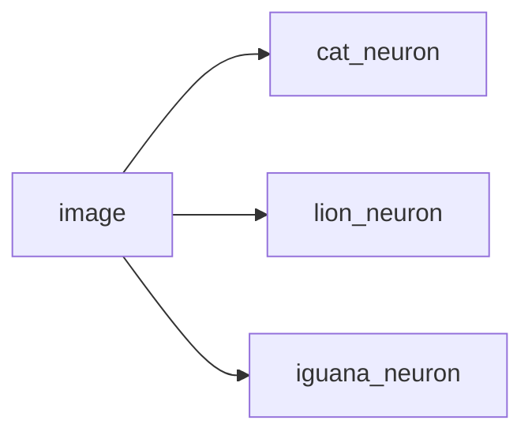

### Neural Network 介绍

#### 类比 Logistic Regression （1）
- 设定目标: 在 image 里找一只 cat

$$
\text{预期: }\hat{y} = \sigma(\omega x + b)\newline
\text{损失: }\mathcal{L} = -[ y\log(\hat{y})+(1-y)log(1-\hat{y})] \\
\implies \begin{cases}
\omega = \omega -\alpha \frac{\partial{\mathcal{L}}}{\partial{\omega}}\newline
b = b - \alpha \frac{\partial{\mathcal{L}}}{\partial{b}}
\end{cases}
$$

- 流程 
    1. 初始化 $\omega , b$
    2. 迭代找到最优的 $\omega, b$
    3. 用公式 $\hat{y} = \sigma(\omega x + b)$ 预测

#### 介绍Neural Network
$\text{Neuron} = \text{Linear} +\text{Activition}$
- 因此可以把 Logistic Regression 看做 一个neuron

$\text{Model} = \text{Architecture} + \text{Parameter}$

#### 类比 Logistic Regression （2）
- 升级目标: 在 image 里找 cat/lion/iguana

- 模型具有鲁棒性，因为神经元之间没有交流
- 问题也在这里，如果某个神经元训练不足，这个模型无法顺利工作